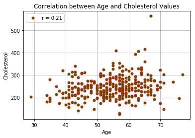
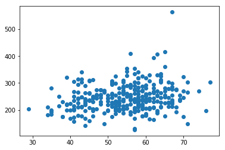
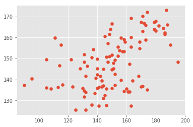

---
output:
  pdf_document: default
  html_document: default
---

## Python Workshop 
*__*

Date: Feb 28, 2019

Author: Senthilkumar, Postdoc, Human Genetics, MUGIC

Acknowledgement :???, HGSS


```python
import sys
print(sys.version)
```

#### Note
1. Pre install anaconda 3
2. Test Editor, Os specific: Mac/Windows: Sublime.
3. Give primer for basic UniX/Linux Command. echo $SHELL


#### 1. Unix/Linux command

*ls*
 
*cd ..*

*mkdir *

*Create a workspace/Directory/Project for the Workshop*

###### **End Goal:**
* You should be able to open a notebook /TextEditor. Type commands
     - Yeah! My first text file. what is a file extension ? Prefix/suffix significance
* File name etiquettes.
    - Use meaning names for prefix. Added py to the suffix if its a python file.
 
        
    

#### 2. First Python code in TextEditor
*Note: make sure syntax highlighting is ON. difference for each version of TextEditor.*

* Open the editor and type *<font color=blue>print('Hello World')</font>*

* Save the file as <filename>.py

* Open a Terminal/Console/cmd/ and run the following command


###### **End Goal:**
* You should to run a simple one line python code.
    - python my_first_python_code.py
    - See what happend if you add **#** in front of the print line. What is commenting?


```python
%run my_first_python_code.py

# You just ran your first python code.

```

##### 3. Variables and Casting


```python

#Variables
var1 = "Some characters/strings"
var2 = 5 #integer
var3 = 4.5 # float
var10 = True #logical 

var4= 9.999999
#Casting
print(var3)

print(int(var3))

print (float(var2))

var5 = str(var2)

print(var2 + var3)

#print(var5 + var3) #error why?


var6= " Appended"
print(var1 + var6) #concatenating strings


```

##### 4. Lists


```python
list1 = [var1, var2 , var3, var4 ]
print(list1)

print(list1[1]) # Zero based index. Indexing starts at "0"

print(list1[0])

#print (list[4]) # error!

print(list1[-1]) #


```

Questions:
    1. Whats the last but one variable?
    2. Is the reverse zero indexed?

#### 5. Slicing and Subsetting


```python
list1 = [var1, var2 , var3, var4, var5, var6]
print(list1)

list2 = list1[0:3] 
# list2 = list1[:3]
#list2 = list1[2:]

list2 = list1[2:-1] # What is upperbound lowerbound?
list2 = list1[1:3] # includes bottom but not top
print (list2)
```

#### 6. Dictionaries


```python
students1 = {29940:'David', 3459:'Marco'}
#print('David')# error
print(students1[29940])

#Example 2 
released = {
		"iphone" : 2007,
		"iphone 3G" : 2008,
		"iphone 3GS" : 2009,
		"iphone 4" : 2010,
		"iphone 4S" : 2011,
		"iphone 5" : 2012
	}
print(released['iphone 5'])

#example3 : ID,[Name, Age]
students3 = {'2990':['David', 35],'3459':['Marco',25]}
#print('David')# error
print(students3['2990'])

#example4 
#example3 : ID,[Name, Age, address]
students4 = {2990:['David', 35, "23, Rue Berri, QC "],3459:['Marco',25, '34, St Benovel st., MTL']}
#print(David)# error
print(students4[3459])


```

Note:
    1. Can we add any type of data to the key:value pair.
   

#####  7. Booleans


```python
# Booleans 

x = True
y = False
x = 5 == 1
print(x)


#Boolean values respond to logical operators and / or

# True and False = False

# True and True = True

# False and True = False

# False or True = True

# False or False = False
comparison = "Apples" == "Intergenic" # False

print("----------")
print(comparison)
```

##### 8. Conditionals


```python
if True:
    print("Yes, TRUE")
if False:
    print("Yes, False")
    
x = 4
if x > 3:
    print("Yes, Its greater than 3 ")

if x < 3:
    print("Nope")

print (x)   

print("-------------")
#else 

if True:
    print("Its  True")
else:
    print("Not True")
#-------------
if x > 2 and x <4:
    print("Its  True")
else:
    print("Not True")
#-------------   
    
if x > 2 or x <5:
    print("Its  4")
else:
    print("Not True")
    
```

#### 9. Loops


```python
#example1 
print("#Example1 : ") 
for i in range(0,10):
        print(i)
        
        
   
#example2 
print("#Example2 : ") 
for i in range(0,10):    
        if i % 3 == 0:
            print("Fizz",i)
        else:
            print("Buzz",i)
            
#example3
print("#Example3 : ")  
for i in range(0,10):    
        print("")
```

#### ASSIGNEMENT 2
*__*


```python
# Assignment 1

#Draw a Rectangle os size h = 25, w =20

w =30*"*"
h = "*" +28*" " + "*"

for i in range (0,25):
    if i == 0 or i == 24 :
        print(w)
    else:
        print(h)

```

#### 10.  FILE HANDLING

Download the heart dataset from [Kaggle](https://www.kaggle.com/ronitf/heart-disease-uci). You will have to register in their site to download.


```python
#Open and read file line by line.
import codecs

filepath="/Users/User/Documents/HGSS_Workshop/heart.csv"
ages =[]

#dos2unix in commandline if the file  has gibbersih header.

#with codecs.open(filepath, "r", encoding="utf-8-sig")as infile:
with open(filepath, "r")as infile:
    first_line = infile.readline() #skip the header(first) line
    for line in infile:
        line = line.rstrip()
        data = line.split(',') # somestrinh.split('delimiter')
        age = data[0]
        ages.append(int(age))
        
print(ages)
        
        
```

#### 11. Loading modules


```python
        
# load libraries and set plot parameters
import numpy as np
#import PrettyTable as pt

import matplotlib.pyplot as plt
%matplotlib inline
```

##### 11. PLOTTING


```python
import matplotlib.pyplot as plt
#plt.hist(ages)
plt.hist(ages,bins=25, density=True, color="green", label="age")


```


```python
#for cholesterol 
chols = []
with open(filepath, "r")as infile:
    first_line = infile.readline() #skip the header(first) line
    for line in infile:
        line = line.rstrip()
        data = line.split(',') # somestrinh.split('delimiter')
        chol = data[4]
        chols.append(int(chol))
#print(chols)
    
#plt.hist(ages)

#calculate Pearson Corr value
import numpy as np
corr_val = np.corrcoef(ages,chols)[0][1]
plt.plot(ages,chols,color='red', linestyle='', marker='o',
                    markersize=5, mfc="green", markerfacecoloralt='black', label = 'r = %.2f' % corr_val)
plt.legend()
plt.xlabel('Age')
plt.ylabel('Cholesterol')
plt.title('Correlation between Age and Cholesterol Values')
plt.grid(True)
plt.savefig("figure_Age_vs_Cholesterol.png")
```





###### **End Goal:**
* You should be able to search the error message in google to get answers.


```python
# PLotting example 2: 
x_values = [i for i in range(1,10)] # make a list of the array
print(x_values)

y_values = []
for x in x_values:
    y = x**2
    y_values.append(y)
print(y_values)
plt.plot(x_values,y_values, color='red', linestyle=':', marker='o',
                    markersize=5, mfc="green", markerfacecoloralt='black')

```

#### Additional:  Dataframe  way of handling Files


```python
#example 2 using pandas
import pandas as ps
df = ps.read_csv("heart.csv")
df = ps.DataFrame(df)

plt.scatter(df['age'],df['chol'])


#Explore Data
#print(df.head(3))


#print(df.feature)

#print(df.info)
```


    <matplotlib.collections.PathCollection at 0x11614c410>





#### 12. Machine Learning Sample


```python
#example 2 using pandas
import pandas as pd
from sklearn.linear_model import LinearRegression
import matplotlib
import matplotlib.pyplot as plt
%matplotlib inline
matplotlib.style.use('ggplot')

df = ps.read_csv("heart.csv")
df = ps.DataFrame(df)
df  = df.sample(frac=1)


# The whole date set 
x = df[['age','sex','chol','trestbps','target']]
y = df['thalach']
# split into Train and Test sets 
#TRAIN
x_train = x[:200]
y_train = y[:200]

#TEST
x_test = x[200:]
y_test = y[200:]


#print(y_test.shape)
lm = LinearRegression()
lm.fit(x_train,y_train)
print(lm.coef_)
print(lm.score(x_train,y_train))

print("True Values")
print(np.array(y_test))
print("Prediction in Test")
print(lm.predict(x_test))


corr_val2 = np.corrcoef(np.array(y_test), lm.predict(x_test))

plt.scatter(np.array(y_test), lm.predict(x_test))


```

    [-0.87268582  1.27009571  0.02833352  0.12769463 18.74015779]
    0.31020587537465383
    True Values
    [187 163 179 115 172 144  95 144 156 174 152 122 186 150 148 182 141 125
     188 145 151 141 154 170 147 163 137 132 131 142 133 147 162 156 163 169
     159  90 173 150 128 132 145 136 136 161 140 171 173 146 131 114 169 164
     171 195 160 180 168 123 150 130 108 155 152 131 190 152 170 150 185 105
     143 162 154 113 143 116 132 138 180 111 149 146 146 144 105 140 179 140
     131 163 158 158 186 157 151 171 158 140 174 139 148]
    Prediction in Test
    [172.98352088 127.53764951 163.92603741 156.53172313 166.91933995
     136.9955259  140.29320028 145.08391094 159.92452774 135.12288174
     137.3680459  149.49951715 162.35453443 166.63674534 161.49196617
     165.58081391 136.3351477  125.62029226 165.99638101 132.55027797
     145.16293007 127.36281684 151.18141783 136.66687694 148.40474637
     159.98090051 154.39461915 141.70876026 131.7140506  141.70317454
     146.40753452 157.09758388 147.34628926 139.59434462 169.29858055
     157.85929555 157.92795109 137.28921189 158.90721371 144.81382022
     145.25400535 125.56029731 160.4804454  128.01559176 150.57089211
     134.26573128 145.20302471 170.21629795 165.96610965 127.70769728
     151.88534641 146.71973088 154.84220887 139.34431441 136.69516382
     148.25977724 135.60335435 163.24230928 141.49492262 136.54149561
     151.72743918 135.91657335 135.60713674 153.87711791 142.50888847
     148.4350772  156.54755277 149.24198907 167.38998928 135.93925355
     164.36995014 136.04770944 139.36440946 134.25287436 155.51724189
     136.37407964 136.64410345 137.45394796 133.82021349 133.35750835
     167.72666361 159.87287882 163.84562076 135.55923784 150.62803855
     131.0454663  149.53395032 142.30540775 167.19427432 149.72097832
     134.69823196 155.58081825 153.30386699 134.36614154 161.56908129
     153.28686651 147.87202898 162.9646274  159.01566961 135.80052629
     172.1425634  140.73750872 151.00892485]


    <matplotlib.collections.PathCollection at 0x115add710>





#### Footnote:

